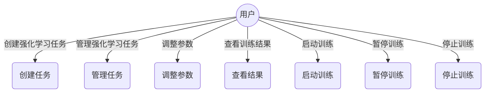

# MarkovLibrary

各种算法的实验室

```mermaid
graph TB
  user((用户)) -->|创建强化学习任务| create_task(创建任务)
  user -->|管理强化学习任务| manage_task(管理任务)
  user -->|调整参数| adjust_params(调整参数)
  user -->|查看训练结果| view_results(查看结果)
  user -->|启动训练| start_training(启动训练)
  user -->|暂停训练| pause_training(暂停训练)
  user -->|停止训练| stop_training(停止训练)
```
