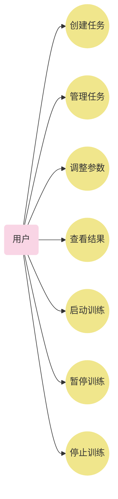

# MarkovLibrary

各种算法的实验室

```mermaid
graph LR
    actor(用户) --> create_task((创建任务))
    actor --> manage_task((管理任务))
    actor --> adjust_params((调整参数))
    actor --> view_results((查看结果))
    actor --> start_training((启动训练))
    actor --> pause_training((暂停训练))
    actor --> stop_training((停止训练))

style actor fill:#f9d5e5,stroke:#f9d5e5
style create_task fill:#f0e68c,stroke:#f0e68c
style manage_task fill:#f0e68c,stroke:#f0e68c
style adjust_params fill:#f0e68c,stroke:#f0e68c
style view_results fill:#f0e68c,stroke:#f0e68c
style start_training fill:#f0e68c,stroke:#f0e68c
style pause_training fill:#f0e68c,stroke:#f0e68c
style stop_training fill:#f0e68c,stroke:#f0e68c
classDef person icon:fa-user;
class actor person;

```
