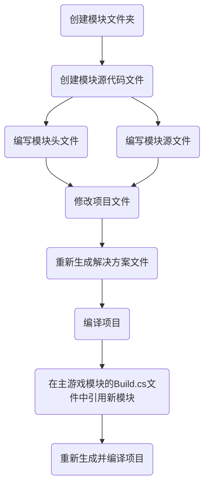

# MarkovLibrary

各种算法的实验室

```mermaid
graph TD
A(创建模块文件夹) --> B(创建模块源代码文件)
B --> C(编写模块头文件)
B --> D(编写模块源文件)
C --> E(修改项目文件)
D --> E
E --> F(重新生成解决方案文件)
F --> G(编译项目)
G --> H(在主游戏模块的Build.cs文件中引用新模块)
H --> I(重新生成并编译项目)
```
