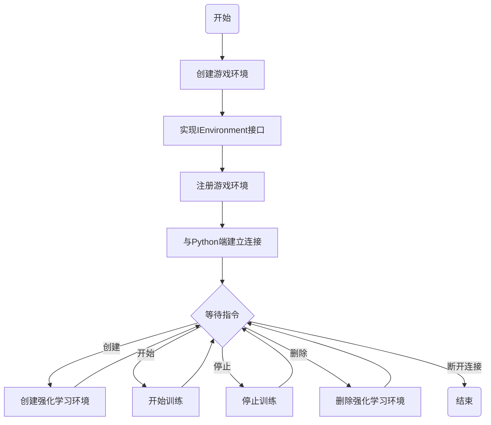
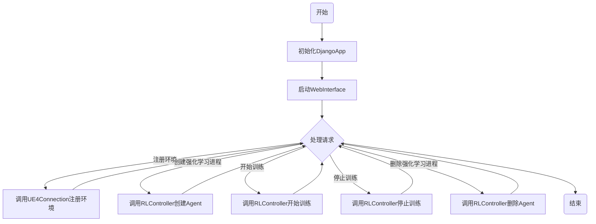

# MarkovLibrary

各种算法的实验室

```mermaid
graph TD
A(开始) --> B[创建游戏环境]
B --> C[实现IEnvironment接口]
C --> D[注册游戏环境]
D --> E[与Python端建立连接]
E --> F{等待指令}
F -->|创建| G[创建强化学习环境]
G --> F
F -->|开始| H[开始训练]
H --> F
F -->|停止| I[停止训练]
I --> F
F -->|删除| J[删除强化学习环境]
J --> F
F -->|断开连接| K(结束)
```

```mermaid
graph TD
A(开始) --> B[初始化DjangoApp]
B --> C[启动WebInterface]
C --> D{处理请求}
D -->|注册环境| E[调用UE4Connection注册环境]
E --> D
D -->|创建强化学习进程| F[调用RLController创建Agent]
F --> D
D -->|开始训练| G[调用RLController开始训练]
G --> D
D -->|停止训练| H[调用RLController停止训练]
H --> D
D -->|删除强化学习进程| I[调用RLController删除Agent]
I --> D
D --> J(结束)
```
