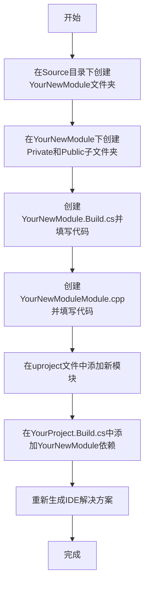

//YourNewModule.Build.cs

```cs
using UnrealBuildTool;

public class YourNewModule: ModuleRules
{
        public YourNewModule(ReadOnlyTargetRules Target) : base(Target)
        {
	PrivateDependencyModuleNames.AddRange(new string[] {"Core", "CoreUObject", "Engine"});
        }
}
```

YourNewModuleModule.cpp

```cpp
#include "Modules/ModuleManager.h"

IMPLEMENT_MODULE(FDefaultModuleImpl, YourNewModule);
```

在 YourProject.uproject 中的"Modules"加入:

```Json
{
            "Name": "YourNewModule",
            "Type": "模块类型"
}
```

YourProject.Build.cs

```cpp
PublicDependencyModuleNames.AddRange(new string[] { "Core", "CoreUObject", "Engine", "InputCore", "YourNewModule" });
```
